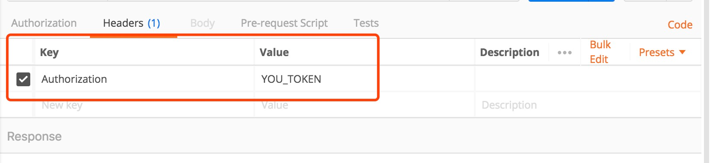
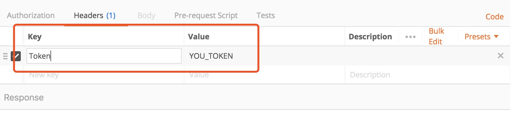
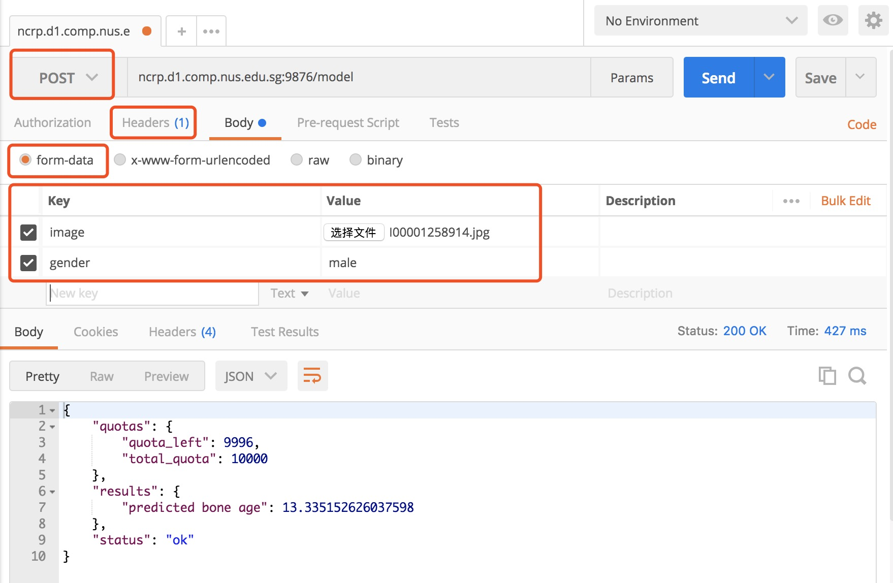
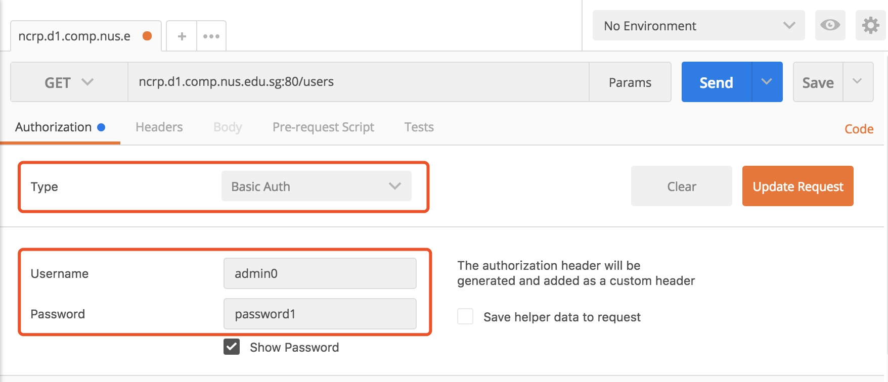

= Bone Age Predictor
:toc:

This Flask app provides a RESTful API for users to send lung Xray images for
inference. Requests are limited by a user's remaining quotas.
Users must include an admin-issued token in their HTTP requests.

== Quickstart for deployment in a Docker container

1. In a command line interface, navigate to the project root folder.
2. Build as a Docker image using `docker build -t IMAGE_NAME .` Don't forget that
trailing period behind `IMAGE_NAME`.
3. Run `nvidia-docker run -d -p $port_out:5000 -v /path/to/params:/root/params IMAGE_NAME python /root/app.py -p /root/params/PARAMS_FILE_NAME` to make a container out of the image.  You can replace `port_out`, `/path/to/params` and other arguments as you want.

4. Use `docker container ls -a` to check your containers list to find out if
port Docker has assigned successfully as you set by the command in Step 3.
5. For example, in the `PORTS` column,
seeing `0.0.0.0:32771–>5000/tcp` means that your port `0.0.0.0:32771` is mapped to
the container's port `5000`.
6. Thus, access `0.0.0.0:32771` in your browser or using app like Postman to 
sent information.

*Some extra details regarding Step 3.* The `-d` argument starts it in the background, while the `-p` argument
tells Docker to assign it a port. 

== Guide for API users
=== How to include your token in HTTP requests
There are 3 ways to include your token, according to your preference.

*  Include it as a URL querystring argument like in the three examples below.
This is not recommended, since URLs are often kept in log files.
Your token would be subjected to security risks.

    http://[hostname]/check-quota?token=YOUR_TOKEN_HERE

    http://[hostname]/echo?token=YOUR_TOKEN_HERE

    http://[hostname]/model?token=YOUR_TOKEN_HERE

*  Include your token in the `Authorization` header of your HTTP request

     
*  Include your token in the `Token` header of your HTTP request.

=== How to check your remaining request quota

Use a HTTP GET request on `http://[hostname]/check-quota`.

You will receive a `200 OK` response with a JSON body just like the following:

    {
        "status": "ok",
        "quotas": {
            "quota_left": 42,
            "total_quota": 50
        }
    }

However, if your `quota_left` reaches zero, the response will be
`401 Unauthorized` with the following JSON instead.

    {
        "status": "error",
        "code": "Unauthorized",
        "message": "No more usage quota.",
        "quotas": {
            "quota_left": 0,
            "total_quota": 50
        }
    }

=== How to make a model prediction request
Use a HTTP `POST` request on `http://[hostname]/model`.

In request body, choose form-data, then input key and value.
For the key 'gender', you should input either female or male.
Other input are not allowed.
You will receive a `200 OK` response with a JSON body just like the following:

    {
    "quotas": {
        "quota_left": 9996,
        "total_quota": 10000
    },
    "results": {
        "predicted bone age": 13.335152626037598
    },
    "status": "ok"
}

Again, if your `quota_left` reaches zero, the response will be
`401 Unauthorized` with the following JSON, just like in `check-quota`.

    {
        "status": "error",
        "code": "Unauthorized",
        "message": "No more usage quota.",
        "quotas": {
            "quota_left": 0,
            "total_quota": 50
        }
    }

=== How to make the server echo your image
This helps you to check if the server is receiving the image as you expect it to.

1. Prepare a HTTP `GET` request on `http://[hostname]/echo`.
2. Include your image in your HTTP request body.
3. Don't forget to include your token in the request.
4. You will receive a `200 OK` response with the same image, exactly as the server
received it, back in the HTTP response body.

== Admin operations
Admins manage the user database.

=== How to login as an admin
All admin requests require a HTTP Basic login with an admin's username and
password. By default, a admin accounts exist in the `admins.py` module, and it can be used
immediately for operations, but will need to be removed prior to actual deployment
(since they're exposed here on GitHub). Its details as such:

|===
|Username |Password

|`admin0`
|`password1`

|===
You can login  like the following figure shows.

=== How to edit admin accounts
All admin information must be stored in the `admins.py` module's `get_password_hashes()` function.

    def get_password_hashes():
        return {
            "admin0": "password_hash_1",
            "admin1": "password_hash_2",
            "admin2": "password_hash_3",
            "admin3": "password_hash_3",
            ...
        }

Passwords themselves are not stored directly. Only their
*http://passlib.readthedocs.io/en/stable/lib/passlib.context.html#passlib.context.CryptContext.encrypt[PassLib-encrypted]*
hashes are stored.

To add and remove admin accounts, you can add your own admin username and
password hash directly to the dictionary. To generate a hash from your raw password:

1. Run `python admins.py`
2. Enter your admin password when prompted
3. Copy the new hash into the `admins.py` module's `get_password_hashes()` dictionary.

=== Summary of admin operations
This table is a summary of the operations available for admins.
Further elaboration is provided below the table.

|===
|Method |URI |JSON fields| Action

|`GET`
|`[hostname]/users`
|Not Applicable
|Retrieves a list of users

|`GET`
|`[hostname]/users/<string:name>`
|Not Applicable
|Retrieves a particular user's info

|`POST`
|`[hostname]/users/<string:name>`
|`name`, `token`, `total_quota`, `quota_left`
|Adds a user

|`PUT`
|`[hostname]/users/<string:name>`
|`name`, `token`, `total_quota`, `quota_left`
|Updates a user

|`DELETE`
|`[hostname]/users/<string:name>`
|Not Applicable
|Deletes a user
|===

=== Retrieving a list of all users
`GET` `http://[hostname]/users` returns a JSON similar to the following:

    {
        "status": "ok",
        "users": [
            {
                "name": "tom",
                "token": "13CA31",
                "quota_left": 0,
                "total_quota": 10
            },
            {
                "name": "rob",
                "token": "31FA56G4FA",
                "quota_left": 3,
                "total_quota": 10
            },
            {
                "name": "smith",
                "token": "48F65D",
                "quota_left": 51,
                "total_quota": 1000
            }
        ]
    }

=== Retrieving a single user by name
`GET` `http://[hostname]/users/[username]` returns a JSON similar to the following:

    {
        "status": "ok",
        "user": {
            "name": "tom",
            "token": "G12X6",
            "quota_left": 4,
            "total_quota": 10
        }
    }

=== Add a user
Call `POST` `http://[hostname]/users` but include a JSON in the body,
like that of the example below.

    {
        "name": "jaMeS ",                   # Compulsory string
        "token": " D3G34K1AD",              # Optional string; is generated if not specified
        "quota_left": 49,                   # Optional integer; set to 10 if not specified
        "total_quota": "50"                 # Optional integer; set to same as total_quota if not specified
    }

You will get back a JSON response with the info of the user you've successfully added.

    {
        "status": "ok",
        "user": {
            "name": "james",
            "token": "D3G34K1AD",
            "quota_left": 49,
            "total_quota": 50
        }
    }

Here's a summary of restrictions on the values of a new user's info:
|===
|Key |Value |Compulsory? | Must be unique? |Value if not specified

|`name`
|`<string>`
|Yes
|Yes
|Not Applicable

|`token`
|`<string>`
|No
|Yes
|Some 32-character token

|`total_quota`
|`<int>`
|No
|No
|10

|`quota_left`
|`<int>`
|No
|No
|Same as `total_quota`
|===

The finer details are here:

1. `name` *is compulsory and must have a unique string associated with it.* The string cannot
exceed 80 characters in length.
Leading and trailing whitespace will be stripped. It will be stored in the database
in lowercase. In the database, each user's `name` must be unique.
2. `token` *is an optional field. If included, it must be a string, and be different
from that of other users in the database.* It cannot be longer than 64
characters. If not included, a randomly-generated 32-character
string of uppercase letters, lowercase letters, and digits, will be set as the
token instead.
3. `total_quota` *is an optional field. If it exists, it must correspond to a non-negative integer.*
If not included, it will be set to the default of 10.
4. `quota_left` *is an optional field. If it exists, it must correspond to a non-negative integer
that is less than or equal to that of* `total_quota`*.*
If not included, it will be set to whatever `total_quota` is.

=== Update a user
Use `PUT` `http://[hostname]/users/[username]` and include the following JSON in your request body.
The app checks which fields you've included or excluded and updates the existing user's info to the new
state accordingly.

    {
        "name": "james",                    # Optional
        "token": "D3G34K1AD",               # Optional
        "quota_left": 49,                   # Optional
        "total_quota": "50"                 # Optional
    }

You will get back a JSON response with the new
info of the user you've successfully updated, as well as the info that the user
previously held.

    {
        "status": "ok",
        "user": {
            "name": "james",
            "token": "D3G34K1AD",
            "quota_left": 49,
            "total_quota": 50
        }
        "old_info": {
            "name": "jamezzz",
            "token": "password1",
            "quota_left": 4,
            "total_quota": 10
        }
    }

=== Delete a user
Use `DELETE` `http://[hostname]/users/[username]`. You will get back a JSON response with the info of the user you've successfully deleted.

    {
        "status": "ok",
        "user": {
            "name": "tom",
            "token": "G12X6",
            "quota_left": 4,
            "total_quota": 10
        }
    }

